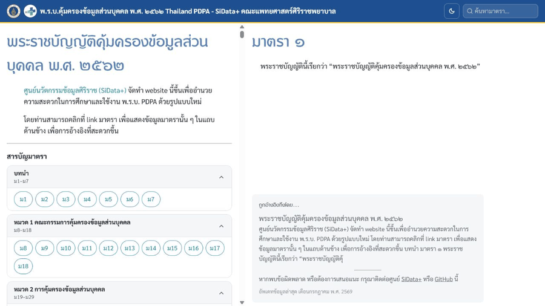

# Thai PDPA Website (Unofficial)



The content on this website is based on [the official document of Thailand's Personal Data Protection Act (PDPA) B.E. 2562](http://www.ratchakitcha.soc.go.th/DATA/PDF/2562/A/069/T_0052.PDF).

The website represents PDPA in a new format using interactive stacked pages and wiki-links, built with [Next.js](https://nextjs.org).

The goal is to provide ease of access to PDPA and allow tracking of article references. Users can open referenced articles and supplementary legal references on the side portion of the desktop screen or landscape tablet.

## How-to

This website is built with [Next.js](https://nextjs.org). To contribute, please consult its [documentation](https://nextjs.org/docs).

### Requirements

- Node.js v22.16.0 (minimum supported version is v20.9.0)
- npm

### Install

Clone this repository to your machine. At the repository's root directory, run

```{bash}
npm ci
```

### Development

Run

```{bash}
npm run dev
```

Then go to `localhost:3000` in your browser of choice. Any changes to the files saved will be automatically updated on the website.

### Content

Article order and chapter structure are maintained once in `content/act-structure.json`.

Related articles for a consultation are maintained in that consultation's frontmatter. Do not duplicate consultation cards or presentation HTML in article Markdown files:

```yaml
---
articles:
  - 24
  - 26
---

# เลขที่เรื่อง ๙/๒๕๖๗

## เรื่อง ตัวอย่างหัวข้อหารือ
```

The consultation title and summary are derived from the `เลขที่เรื่อง` and `เรื่อง` lines in its Markdown content.

Consultation filenames are canonical public identifiers and use
`consultation-YYYY-NNN.md`, where `YYYY` is the Buddhist year and `NNN` is the
zero-padded consultation number. For example, `เลขที่เรื่อง ๙/๒๕๖๗` belongs in
`content/discussion/consultation-2567-009.md`. The title does not need a
separate slug field.

Legacy filenames are maintained centrally in
`content/discussion-redirects.json`. `npm run gen` turns that map into static
redirect routes and Cloudflare's `public/_redirects`; legacy routes are not
duplicated in search results or the sitemap. The one-time migration audit is
kept in `content/discussion-migration.json`.

Collapsible sections use one consistent format:

```html
<details>
<summary>ความเห็น</summary>

Markdown content

</details>
```

Run `npm run format:content` to normalize these sections automatically.

`npm run lint` validates article ranges, consultation metadata, canonical
filenames, duplicate content, redirect integrity, internal links, duplicate
slugs, balanced disclosure sections, and disallows inline presentation markup
in content.

### Build

Run

```{bash}
npm run check:production
```

This checks the source, verifies all 96 articles, builds the site, and validates the generated routes, links, JSON, metadata, and security configuration.

The generated static site will be available at `out`.

### Deployment

Once code is pushed or merged into the deployment branch on GitHub, Cloudflare Pages will build and deploy the site automatically. Cloudflare Pages should use `npm run check:production` as the build command and `out` as the build output directory. If unsure, open a Pull Request first instead of pushing directly to the deployment branch.

## Contributions

Contributions are highly welcome. Please submit your PRs.

## Roadmap

- Maintain the official Thai PDPA article content
- Add and maintain supplementary legal references
- ...(more to come)...
